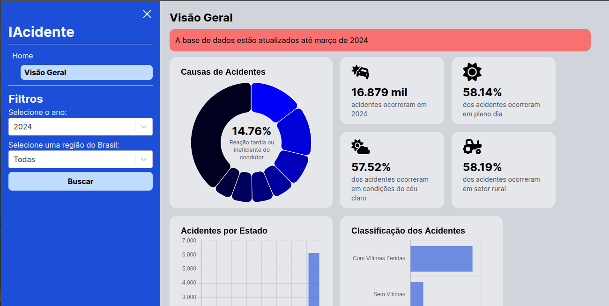

# IAcidente

A web application that analyzes and displays data about accidents on federal highways in Brazil through interactive charts and visualizations.

[](https://youtu.be/dLbmqlrwums)

## Project Structure

The project is divided into two main parts:

- `client/` - React frontend application
- `server/` - Python Flask backend API
- `database/` - SQLite database files containing accident data from 2007-2024

## Features

- View accident statistics across different Brazilian regions and states
- Filter data by:
  - Year (2007-2024)
  - Region (North, Northeast, South, Southeast, Center-West)
  - State
- Visualize data through multiple chart types:
  - Accident causes
  - Accident classification
  - Distribution by state/city
  - Time of day analysis
  - Weather conditions
  - Zone analysis (Rural/Urban)

## Technologies Used

### Frontend

- React
- React Router
- Chart.js
- Tailwind CSS
- Vite
- Axios

### Backend

- Python
- Flask
- SQLite3

## Setup

1. Clone the repository:

```bash
git clone <repository-url>
cd iacidente
```

2. Install backend dependencies

```bash
cd server
pip install -r requirements.txt
```

3. Install frontend dependencies

```bash
cd ../client
npm install
```

## Run the application

1. Start the backend server

```bash
cd server
python app.py
# The Flask server will run on http://localhost:5000
```

2. Start the frontend development server

```bash
# You need to open a new terminal
cd client
npm run dev
# The Vite server will run on http://localhost:5173
```

## API Endpoints

GET /visaogeral

Returns accident statistics based on query parameters:

- year: Year of accidents (2007-2024)
- region: Brazilian region name
- state: State abbreviation (optional)

Example response:

```
{
	"quant_acidents": 1234,
	"cause": [...],
	"classification": [...],
	"moment_day": [...],
	"weather_condition": [...],
	"acident_zone": [...],
	"states/cities": [...],
	"coordenates": [...], # Only for years > 2016
}
```

## Project Structure

- `client/`: # Frontend React application
  - `src/`:
    - `assets/`: # Static assets (images, CSS and etc...)
    - `components/`: Reusable React components
    - `contexts/`: # React contexts
    - `hooks/`: # Custom React hooks
    - `pages/`: # Page components
    - `reducers/`: # State management reducers
    - `routes/`: # Route components
    - `main.jsx/`: # Application entry point
    - `Routes.jsx/`: # Route definitions
  - `index.html/`:
- `server/`: # Frontend React application
  - `app.py`: # Main application file
  - `traffic_data.py`: # Data processing logic
- `database/`: # SQLite database files (2007-2024)

## Data Source

The data used in this application comes from [PRF (Federal highway Police)](https://www.gov.br/prf/pt-br/acesso-a-informacao/dados-abertos/dados-abertos-da-prf)

## Author

[Thawan Silva](https://www.linkedin.com/in/thawansilva)

## License

This project is open source and available under the MIT License
